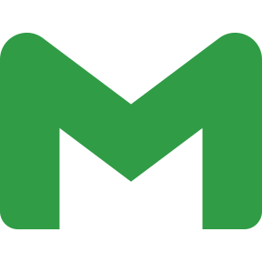
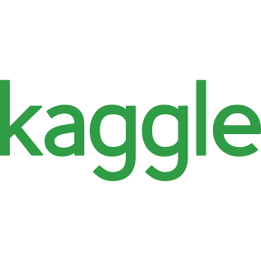

<!-- Intro part -->
<!-- Typing SVG - https://github.com/DenverCoder1/readme-typing-svg -->

***

<!-- Social icons section -->

  
  &#8287;&#8287;&#8287;&#8287;&#8287;
  
  &#8287;&#8287;&#8287;&#8287;&#8287;
  
  &#8287;&#8287;&#8287;&#8287;&#8287;
  

  
  &#8287;&#8287;&#8287;&#8287;&#8287;
  
  &#8287;&#8287;&#8287;&#8287;&#8287;
  
  &#8287;&#8287;&#8287;&#8287;&#8287;

***

<!-- Bio part -->
### A little about me...
I'm an **Undergrad Student at 🏛[the Polytechnic University of Peter the Great](https://english.spbstu.ru/)** pursuing CSE.  I'm a **tech enthusiast 💻** who is passionate about machine learning. I am currently studying data science to dive further into machine learning.    

<!-- My targets -->
## What I do now 🌱

- [x] Learning Python and basic algorithms and data structures
- [ ] Learn Pandas, Numpy, Scipy, Matplotlib, Seaborn
- [ ] Understand linear algebra, probability theory, statistics and mathematical analysis
- [ ] Dive in TensorFlow, PyTorch
- [ ] Create a pet-project on the subject of financial forecasting or smth else
- [ ] Get a job like ML-engineer

🌱 All my study u can find here: **[ds-way](https://github.com/Hanabiraa/ds-way)** 

***
